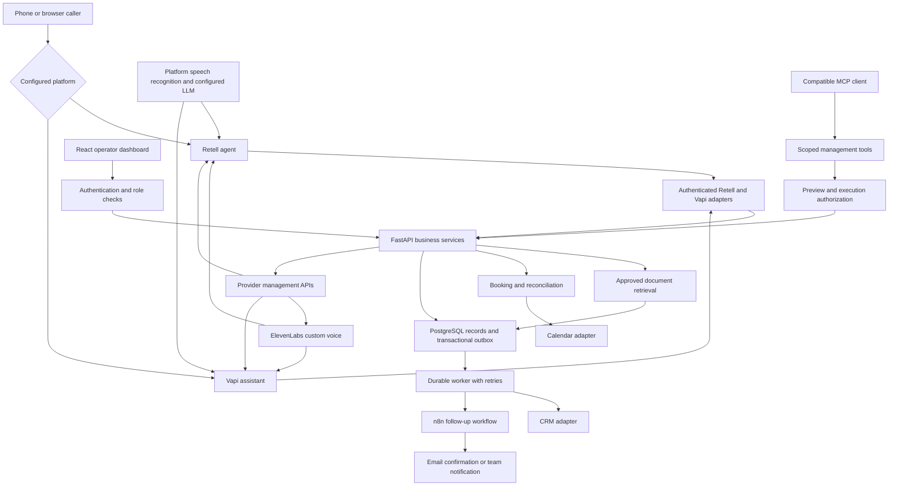

# VoiceBridge production build plan

VoiceBridge is an AI voice receptionist and business automation application. Build a complete frontend first, connect it to a verified backend, then deliver custom ElevenLabs voices through Retell and Vapi. Both voice platforms use the same business services for knowledge lookup, appointment booking, CRM updates and follow-ups.

This plan defines ten sequential phases with 50 implementation criteria, plus 30 readiness criteria covering USA/EU legal applicability, future capacity, reliability, strict security, monitoring and maintained documentation. It describes the intended implementation; all 80 criteria are unchecked. A polished interface, a passing controlled or an agent saying "done" cannot substitute for the required real-flow evidence.

## Product scope and delivery boundary

The first implementation serves one configured service business with test-data customers, an English voice and an appointment calendar. Use a configured appliance-repair business as editable implementation data. Start with Retell and add Vapi after the shared business flow works. Administrative records carry an organization boundary from the start, but self-service agency onboarding, customer subscriptions and large-scale hosting are outside this release.

The future roadmap covers one million registered accounts, one million active dashboard sessions and one million simultaneous AI voice calls, including a declared mixed workload. Those are separate capacity targets, not measured capabilities of this pilot. Large-scale hosting is deferred from the initial release rather than omitted from the architecture roadmap. The production reliability objective is 99.9% for explicitly defined service indicators; it is not an achieved uptime figure or a contractual SLA.

The readiness workstreams below start during Phase 1. Apply their release prerequisites before real personal-data processing or production deployment; do not defer compliance, security or monitoring until after launch. Future-capacity criteria are closed only for the workload and stage their evidence actually supports. Documentation authoring does not close an implementation criterion.

The primary flow is: caller asks a question, receives an answer grounded in approved information, chooses an available appointment, confirms the details, receives a booking confirmed by the calendar provider, and receives a follow-up. The operator can inspect the call, booking, CRM result and any failure.

The first voice-specialist deliverable is a working custom voice in Retell, representative recordings and reproducible settings notes in Phase 4. Booking and automation extend that deliverable in Phases 5 and 6. Vapi is an additional supported adapter, not a substitute for the Retell evidence.

Excluded from this build: selling the developer's permanent voice rights, proving human cold-calling experience, mass outbound calling, arbitrary internet crawling, healthcare advice, payment-card collection, production patient data, Kubernetes, automatic cross-platform mid-call failover and a public unlimited-call playground.

## Authenticated pilot update — 2026-10-08

Subsequent execution authorization added Google owner authentication and published
backend03/frontend06 on the existing server.144backend/78frontend tests pass;
all12backend and6frontend release hashes match. Dedicated Retell/Vapi configs pass
native readback, while actual calls remain untested. test-data bookings, durable
worker recovery and captured follow-up passed. Safe local load and passive samples
have evidence with explicit limits. See docs/evidence/pilot-verification.md and the
focused pilot/provider specs. This milestone does not close the broader80 criteria,
prove external delivery, custom voice, million-user capacity or sustained uptime.
The older baseline below is historical; use the rolling checkpoint for current state.

## Current baseline

- Frontend source and locked dependency manifests now exist; twelve destinations and test-data booking/automation flows are implemented. See `docs/frontend-spec.md` and `docs/evidence/frontend-verification.md`.
- React 19.3.0, Motion 14.0.0, TypeScript 6.0.3 and Vite 8.3.3 are installed and verified. Local native Node 24.21.0 runs builds; the existing Windows Node installation powers the presentation launcher.
- Current public frontend has eight destinations and the approved twelve-page operator dashboard. Seventy application tests, three packaging checks, three release checks, types/lint/format/security/build and scoped independent reviews pass. Live Chrome passed 32 public layouts/12 journeys, 52 dashboard layouts/17 journeys and all20-route CSP checks. W01–W14 and H01–H08 meet their frontend/publication scope; all 80 roadmap criteria remain unchecked.
- Actual Git initialization/private protections and installed pre-commit scanners are verified. Manual edit-bridge success is recorded; automatic dispatch on every edit is unproven. Static frontend release03 is published and verified on the authorized existing shared VPS, with all6 release hashes matching and existing apps/DNS/gateway preserved. The local integrated backend meets eighteen test-data-stage acceptance criteria; live provider execution remains disabled. See docs/evidence/core-verification.md for the 107 backend/77 frontend checks, current HTTP/UI/MCP/restore evidence and fresh review with no blocking implementation findings. All80 broader criteria remain unchecked.
- The existing pre-commit configuration targets the Windows scanner environment. Its real hook execution must be proved in Phase 1; do not remove scans to make the setup pass.
- The earlier scaffold session reported repository-metadata write restrictions. Resolve and verify the active environment before relying on commits, ignore protections or installed hooks.
- No subscriptions, provider accounts, phone numbers, cloud resources or chargeable API operations are authorized by this planning request.

### Setup update and current execution order — 2026-10-07

Subsequent user instructions authorized free-first account and local dependency
setup. Google Calendar test authorization, Retell voice inventory, ElevenLabs Free
subscription/models and HubSpot Free contacts access were verified. Vapi dashboard
access works, but one private-key client request received an explicit Cloudflare1010
denial. Vapi support subsequently identified the default Python User-Agent as the
cause and explicitly authorized a changed request. One HTTPX GET /assistant with
an application header returned200 and a valid list; read-only access is verified.
A Vapi support email is recorded as sent; do not recreate or resend it blindly. Current
local dependency checks pass. Full integration, production authorization, real
voice/call execution and delivery are separate gates.

The latest user instruction is to build the business core first, with application
login/authentication later. The user has now issued the start instruction, including Vapi adapter implementation. Develop and verify the shared business
services, persistence and durable worker locally with test-data data and isolated
adapters before customer onboarding/login work. Preserve the original acceptance
criteria: protected endpoints, tenant isolation and authorization must pass before
external exposure, real customer data or billable execution. The phase table below
is the acceptance roadmap, not permission to ignore this updated execution order.
All 50 implementation and 30 readiness criteria remain unchecked.

Resume from the project's ignored `memory/recovery-checkpoint.md`. Update the master
dossier and checkpoint after meaningful changes and verification, before significant
mutations and handoffs, and at safe boundaries during long work as required by
`AGENTS.md`. Historical planning notes must not override current authorization.

## Architecture

Local Docker Desktop and Compose access are verified through the Windows Docker CLI. PostgreSQL, n8n Community Edition and a capture-only email inbox support the local engine. The authenticated n8n confirmation flow returned a verified SMTP receipt; local database backup/isolated restore and scoped MCP SDK flows passed. All eighteen local test-data acceptance criteria have evidence; these checks do not close the full roadmap's live-provider/readiness criteria. Kubernetes access remains unverified. Shared-server Docker was verified for static frontend publication; the static frontend needs no new cluster. Publication evidence is in docs/frontend-deployment-spec.md and docs/frontend-deployment.md.

Use a modular monolith: one FastAPI application, a separate worker process and one PostgreSQL database. Voice audio remains in Retell or Vapi's managed pipeline; the shared backend handles business tools and call events. Avoid routing every audio frame through the application backend.



Retell and Vapi receive separate platform-specific agent configurations. Share business rules, tool schemas where supported, implementation data and evaluation cases; do not assume identical voice or interruption settings produce identical results.

MCP management lets an authorized assistant inspect or change agents and voices. MCP business tools let a voice agent use the application during a call. Give these surfaces separate credentials, permissions and audit records. Verify client and provider capabilities before exposing a tool.

## Implementation choices

| Concern          | Planned owner and approach                                                                                                  | Reason                                                                               |
| ---------------- | --------------------------------------------------------------------------------------------------------------------------- | ------------------------------------------------------------------------------------ |
| Frontend         | React, TypeScript in strict mode, Vite, Motion, semantic CSS tokens and native dialog primitives                            | Implemented test-data dashboard; local Chrome flows verified                         |
| Frontend data    | Typed client generated from OpenAPI; query cache; explicit forms and error states                                           | Avoid a second hand-maintained API contract                                          |
| Backend          | Python, FastAPI, Pydantic and Pydantic Settings; separate routers, services and adapters                                    | Typed contracts and one configuration boundary                                       |
| Persistence      | PostgreSQL, SQLAlchemy and Alembic                                                                                          | Transactions, migrations, relational constraints and recoverable state               |
| Background work  | PostgreSQL inbox/outbox and a separate worker with leases                                                                   | Durable delivery without an additional queue service in the first release            |
| Search           | PostgreSQL full-text retrieval, then pgvector with configured embeddings                                                    | Keep grounded search in the existing database                                        |
| Authentication   | A maintained OIDC integration with server-managed sessions, secure cookies and CSRF protection                              | Avoid inventing an authentication protocol                                           |
| Voice            | ElevenLabs creation workflow; Retell first; Vapi second                                                                     | Match the requested custom-voice evidence                                            |
| Calendar and CRM | Explicit adapter interfaces; local fakes first; one approved real calendar and CRM connector                                | Limit scope while proving a real business outcome                                    |
| Automation       | Local n8n Community Edition for an allowed deployment; versioned workflow exports                                           | Reproducible follow-ups without requiring n8n Cloud                                  |
| Telemetry        | Structured redacted logs, correlation IDs, health checks and OpenTelemetry-compatible measurements                          | Trace a call through tools and follow-ups                                            |
| Packaging        | Locked dependencies, non-root containers and Docker Compose locally; approved redundant topology for production reliability | Reproducible local/local operation with a separate high-availability deployment gate |
| Testing          | Vitest and Testing Library, Playwright, pytest, strict type checks and security scanners                                    | Verify behavior across the UI, HTTP, database and integrations                       |

Exact package versions are chosen in Phase 1 from the real npm/PyPI registries, reviewed for compatibility and pinned in lockfiles. The table is a stack decision, not evidence that dependencies are installed or that a chosen package passes its security gates. Hosting, authentication issuer, calendar account, CRM account and model IDs remain configuration decisions before their respective integration phases.

## Configuration and maintained data

Write the inventory before feature code. The backend settings layer owns deployment and provider configuration. The browser receives an explicitly allowlisted public bootstrap response; it never receives private API keys, refresh tokens, signing secrets or unrestricted provider credentials.

| Value family                                                                                 | Single owner                                                                                         |
| -------------------------------------------------------------------------------------------- | ---------------------------------------------------------------------------------------------------- |
| Provider URLs, API versions, model IDs, timeouts, retries and request limits                 | Typed backend settings populated from environment                                                    |
| Ports, allowed origins, trusted proxies, issuer/audience, storage locations and service URLs | Typed deployment settings and infrastructure configuration                                           |
| Secrets and OAuth tokens                                                                     | Approved secret store or ignored environment files; actual recovery values in ignored CREDENTIALS.md |
| Service catalogue, business hours, branding, FAQ text, email templates and prompts           | Versioned validated data files                                                                       |
| Agent, voice and tool settings                                                               | Validated configuration profiles with revision and provider capability metadata                      |
| Prices, quotas, concurrency, call duration and spending controls                             | Versioned pricing/limits data plus typed operational settings                                        |
| Immutable protocol fields and event names                                                    | One protocol module per provider                                                                     |
| Test scenarios, load shape and evaluation targets                                            | Versioned test-data test/evaluation data                                                             |

Every consumed environment variable must be represented in typed settings and .env.example. Keep examples unmistakably fake. Change provider/model/price/timeout/local data through configuration or data edits rather than business-code edits. Treat Vite build configuration as tooling configuration; frontend business modules must not read ad hoc environment variables.

Do not put secrets in public documentation, fixtures, shell arguments, logs or assistant context. Use Git to prove private files are ignored, unstaged and absent from history before recording actual credentials. The private dossier is the master project narrative; public descriptions are scrubbed derivatives.

## Delivery gates for every phase

Before implementing a phase, turn its criteria into an executable specification or failing reproduction. Use a focused branch and a small reviewable change. Keep later-phase functionality behind disabled configuration until its gates close.

| Gate         | Required evidence                                                                                                  |
| ------------ | ------------------------------------------------------------------------------------------------------------------ |
| Tests        | Meaningful unit, contract and integration checks; regression tests for discovered defects                          |
| Types        | Frontend strict TypeScript and backend strict typing for implemented packages                                      |
| Lint         | Frontend lint and backend Ruff; format checks                                                                      |
| Security     | Actual edit hook, Gitleaks, Bandit and configured Semgrep checks; dependency review and secret/configuration audit |
| Build        | Frontend production build, backend package/container build and migration validation where applicable               |
| Real flow    | Exercise the phase's UI, HTTP, CLI, MCP or provider flow and inspect durable outcomes                              |
| Fresh review | A separate context/session reviews the diff against the criteria; record its verdict                               |
| Records      | Update dossier, phase evidence and escaped-defect log; preserve manual test tools                                  |

A gate not applicable to a documentation-only change must be explained. A missing scanner, inaccessible real provider, failed gate or missing review remains a blocker for the affected implementation claim, not a silent skip.

Establish project commands in Phase 1. Planned targets include web test/typecheck/lint/build, backend pytest/mypy/Ruff/build, a configuration-hygiene test and the machine's security commands. Do not report these commands as existing until the manifests and toolchain have been verified.

Each phase report records criterion IDs, commit/revision, commands and exit codes, environment, real-flow evidence, reviewer verdict and remaining limits. Passing a fake adapter closes fake-adapter criteria only. Write "criteria N/5 met" for a phase, "N/50 implementation criteria met" and "N/30 readiness criteria met" separately. The complete roadmap has 80 criteria; a pilot must not imply future-capacity criteria passed.

## Phase sequence

| Phase | Outcome                                         | Dependency        | External cost boundary                                           | Status                                                                                                     |
| ----- | ----------------------------------------------- | ----------------- | ---------------------------------------------------------------- | ---------------------------------------------------------------------------------------------------------- |
| 1     | Product contract, repository and toolchain      | Existing scaffold | Local only                                                       | Foundation progressed; Git/private protections and scanners verified; broader Phase 1 criteria remain open |
| 2     | Complete frontend with test-data interactions   | Phase 1           | Local local; frontend visual generation authorized for this task | Public/operator frontend published and verified; broader Phase 2 criteria remain open                      |
| 3     | Authenticated API and persistent dashboard      | Phase 2           | Local first; issuer decision before remote use                   | Not started                                                                                                |
| 4     | Custom ElevenLabs voice working in Retell       | Phase 3           | Explicit voice/API/telephony approval                            | Not started                                                                                                |
| 5     | Confirmed bookings and CRM handoff              | Phase 4           | Calendar/CRM terms and test-call approval                        | Not started                                                                                                |
| 6     | Durable n8n follow-ups and recovery             | Phase 5           | Real messaging approval                                          | Not started                                                                                                |
| 7     | Grounded answers and evaluation suite           | Phase 6           | Embedding/model usage approval if paid                           | Not started                                                                                                |
| 8     | Vapi adapter and comparison evidence            | Phase 7           | Explicit Vapi/provider/call approval                             | Not started                                                                                                |
| 9     | Scoped MCP management and business tools        | Phase 8           | Mutating/chargeable tools individually controlled                | Not started                                                                                                |
| 10    | Release rehearsal and approved production pilot | Phase 9           | Hosting and release approval                                     | Not started                                                                                                |

## Phase 1 Product specification and secure foundation

Establish the contracts that the frontend and backend will implement. Define owner, operator, viewer and guest capabilities, the configured business, expected call outcomes, permitted data and the distinction between controlled and real actions.

Also establish the jurisdiction/data-flow register, threat model, workload profiles, reliability indicators and documentation ownership described in L1, H1, S1, R1 and D1. Assign named owners before those responsibilities become operational. Record unresolved applicability, capacity and provider constraints as blockers for the affected action.

Prepare a workspace with apps/web, apps/api, apps/worker, packages/contracts, config, data, infra and documentation. Initialize actual Git only in a writable authorized environment. Preserve all existing manual tools and private records. Install and exercise the configured security hooks without removing a scan. Choose a supported Node/Python runtime, verify registry packages and pin dependencies.

Define the OpenAPI draft and shared domain schemas for organizations, users, agents, voices, calls, tool results, bookings, contacts, jobs, knowledge revisions, evaluation runs and usage records. Define booking and call state transitions before implementing screens. Establish local Compose services, fake adapters and test network isolation.

Acceptance criteria:

- [ ] P1.1 The product contract defines the configured business, roles, test-data data boundary, complete flow and excluded scope.
- [ ] P1.2 Actual Git initialization, private-file ignore/staging/history checks and installed-hook execution are verified; every configured scanner demonstrably runs.
- [ ] P1.3 Chosen runtimes and package registry checks are recorded; reproducible locked setup and applicable test/type/lint/build commands run.
- [ ] P1.4 Domain schemas, API contracts and state transitions validate; the configuration inventory maps each changeable value to one owner.
- [ ] P1.5 Local services and controlled adapters start from a clean setup; ordinary tests refuse real provider network access.

Evidence: approved specification, contract files, toolchain/registry checks, scanner output and clean local startup report. Do not close this phase while the actual Git/security prerequisites remain unresolved.

## Phase 2 Frontend experience and complete controlled journey

Build the responsive operator application before adding live provider connections. Use test-data fixtures through the same API client contract that will later reach FastAPI. Every controlled screen displays that it is a local interaction and cannot make a real call.

Screens: overview, agent editor, voice library/settings, call test panel, call history/detail with transcript and recording state, appointments, contacts, workflow jobs, knowledge sources, evaluation results, integrations, usage and audit history. Keep navigation focused; future surfaces can show an accurate locked state until implemented.

Show loading, empty, validation, unauthorized, failure and retry states. Support keyboard navigation, clear focus, accessible labels, readable transcripts and reduced motion. Keep provider differences visible where they affect configuration or outcomes. Never show invented live success, latency or cost measurements.

Acceptance criteria:

- [ ] P2.1 Planned screens and routes render at the selected desktop and mobile viewports without clipping or inaccessible navigation.
- [ ] P2.2 An operator can edit a draft agent, select a controlled voice, exercise a conversation contract and inspect its resulting controlled booking/contact/job records.
- [ ] P2.3 Empty/loading/error/permission states and destructive-action confirmation are exercised through UI tests.
- [ ] P2.4 Component and browser tests verify keyboard access, form validation and the principal journey; production build and strict types pass.
- [ ] P2.5 test-data state is clearly labelled; the controlled journey sends no real calls/messages and contains no private credentials or fabricated live metrics.

Evidence: browser walkthrough, screenshots, accessibility findings and frontend gate report. Visual acceptance at this phase does not prove backend or voice functionality.

## Phase 3 Backend authentication and persistent operations

Implement FastAPI routers, typed services, repository interfaces and the first Alembic migrations. Replace controlled data progressively with actual HTTP/database results. Generate the frontend client from the verified OpenAPI contract.

Use a maintained OIDC library; verify authorization-code flow protections and server-managed session behavior against a local test issuer first. Select and verify the actual issuer before live login. Apply role and organization checks to every record, query, download and event stream. Derive organization identity from trusted session/integration bindings, not an arbitrary browser or caller argument.

Implement the H2/H3 session, administrator-MFA, secret-storage and data-protection controls before live integrations. Add privacy-safe metrics and traces as the HTTP/database flow is implemented; instrumentation and security tests belong with each feature. Polling is a bounded pilot choice: its request rate must fit S1, and a later change to push delivery needs its own connection-capacity evidence.

Persist agents and configuration revisions, voice metadata, calls, contacts, draft bookings, usage and audit records. Store credential references rather than secret values in application records; actual tokens need protected storage and rotation. Use narrow database privileges, pagination, structured errors, request limits and redacted logs. Start with polling for UI freshness; add authenticated SSE only if the required interaction warrants it.

Acceptance criteria:

- [ ] P3.1 Dashboard actions use the real API and PostgreSQL; restart preserves records and generated clients stay consistent with OpenAPI.
- [ ] P3.2 Login/logout, session expiry, role denial, CSRF protection and trusted-origin behavior pass real HTTP/browser checks.
- [ ] P3.3 Two test-data organizations cannot access each other's records, exports, jobs or artifacts; forged organization IDs fail.
- [ ] P3.4 Migrations apply to a clean database and upgrade an existing fixture; backup/restore preserves the verified records.
- [ ] P3.5 Invalid/oversized requests fail predictably; logs and API/frontend responses reveal no secrets; settings/environment coverage audit passes.

Evidence: authenticated browser journey, cross-organization denial tests, migration and restore reports. Provider operations remain disabled.

## Phase 4 ElevenLabs custom voice and Retell calling

Deliver the first direct voice-specialist sample. Select Voice Design for a designed persona or Professional Voice Cloning when the verified speaker, source recordings and account entitlement support it. Do not clone another person's voice under the developer's identity. The speaker completes any required verification in their own account.

Before uploading real speaker samples or initiating real calls, close the applicable L1-L5 requirements for that limited test, including provider terms, consent/disclosure behavior and data transfers. test-data customer records do not make a real speaker's audio or phone number anonymous. Recipient permission and legal call eligibility are distinct from the developer's cost approval.

Document the voice brief, creation method, permitted use, voice ID, source/sample references, pronunciation cases and settings revisions. Compare candidate voices through real listening tests instead of assuming a clone is always best. Verify the exact Retell import/access path, account ownership and supported model before promising a custom voice will work. Do not assume an account-private voice is automatically portable.

Implement the Retell adapter, authorized call initiation and authenticated webhook receipt. Verify signatures over the raw request body and map events into monotonic call states. Store provider call IDs and artifact references with access/retention policies. Browser calls use permitted scoped credentials; server API secrets never reach the browser.

After an explicit cost approval, make browser calls and at least one real phone-path test using an approved number or existing telephony setup. Tune endpointing, interruption sensitivity, speaking speed, pronunciation, silence behavior and background noise. Demonstrate human transfer or callback handling; document which path was actually tested.

Acceptance criteria:

- [ ] P4.1 A custom ElevenLabs voice has a documented creation/rights basis, verified account access and reproducible settings notes.
- [ ] P4.2 That voice works in the actual Retell account on browser and approved phone-path tests; preserve representative authorized recordings.
- [ ] P4.3 Provider events authenticate, deduplicate and tolerate out-of-order delivery; invalid signatures and mismatched call/organization bindings fail.
- [ ] P4.4 Human listening checks cover interruptions, names/numbers, silence, noise and handoff; report observed latency and unresolved voice defects.
- [ ] P4.5 Duration/concurrency/destination limits and call-start permissions work; no billable test occurs without the required fresh-turn cost approval.

Evidence: custom-voice recordings, redacted configuration export, raw-to-normalized event tests, call trace and concise recreation guide. No claim of natural phone-call quality without listening to the real phone-path audio.

## Phase 5 Appointment booking and CRM integration

Build deterministic business tools for service lookup, availability, appointment creation, cancellation/rescheduling and authorized contact updates. Use validated tool schemas and a tenant-bound call context. Read back service, date, local time/time zone and contact details, then obtain confirmation before submitting a booking.

Use UTC for storage and verified IANA time zones for business hours and presentation. Handle daylight-saving transitions, nonexistent/ambiguous local times, closed days and caller corrections. Availability is provisional until a fresh check and successful provider write.

Record a stable operation/idempotency key and enforce database constraints or locks for competing requests. External calendars do not share the database transaction: keep pending/confirmed/failed/unknown states and reconcile timeouts against provider records. A timeout after a write must not trigger a blind second booking. CRM synchronization follows a confirmed business event and can fail independently without changing the booking into a false success.

Use an internal CRM contact store plus one approved real CRM connector. Verify OAuth scopes, token refresh and account binding. Reading or cancelling an existing appointment requires a suitable verification step; caller ID alone is not identity proof.

Acceptance criteria:

- [ ] P5.1 A real call checks the approved calendar, obtains confirmation and creates an appointment whose provider ID and details match the database/UI.
- [ ] P5.2 Concurrent callers and repeated tool requests cannot produce duplicate confirmed bookings for the application-controlled slot.
- [ ] P5.3 Timeout-after-write, stale availability and calendar rejection enter explicit states and reconcile without a false spoken confirmation.
- [ ] P5.4 Time-zone/DST, corrected details, cancellation and rescheduling cases pass; unauthorized lookup/change of an existing booking fails.
- [ ] P5.5 The contact and CRM handoff match the confirmed outcome; revoked OAuth, missing scope and connector failure remain visible and recoverable.

Evidence: call-to-calendar trace, external calendar inspection, concurrency/fault tests, CRM record and permission-denial proof. Report any external-calendar race limitation rather than claiming universal exactly-once behavior.

## Phase 6 Durable follow-ups and n8n workflows

Implement a persisted webhook inbox and transactional outbox, with a separate worker that claims jobs using leases. Acknowledge asynchronous events only after durable acceptance. Keep time-sensitive call tools on the synchronous path; do not queue a live availability question behind email work.

Create versioned n8n workflows for confirmed booking messages, CRM synchronization, operator notifications and follow-up scheduling. Pass the minimum required data and stable operation key. Keep n8n's editor private and credentials in its approved store. Start with a local SMTP capture sink and test-data CRM endpoint; real delivery requires authorization.

Add retry/backoff, attempts, next-run time, dead-letter state, replay controls and outcome reconciliation. Worker death after sending but before recording success is an uncertain side effect: inspect provider delivery state where possible rather than pretending every channel supports perfect duplicate prevention.

Acceptance criteria:

- [ ] P6.1 A confirmed booking creates a durable outbox job; local n8n sends the expected confirmation into the test inbox and updates job state.
- [ ] P6.2 Killing/restarting the worker or n8n does not lose accepted jobs; expired leases are recovered without overlapping active owners.
- [ ] P6.3 Duplicate/reordered webhooks and repeated replay requests do not duplicate supported idempotent actions.
- [ ] P6.4 Retries, exhausted attempts and ambiguous delivery appear in the dashboard; an operator can reconcile/replay safely with an audit entry.
- [ ] P6.5 After explicit approval, one real follow-up reaches an authorized recipient and its provider receipt is verified; secrets and editor access remain protected.

Evidence: crash/restart experiment, durable job history, local test-inbox proof, approved real-delivery receipt and sanitized workflow export.

## Phase 7 Grounded knowledge and evaluation

Implement approved document/FAQ ingestion with MIME/size validation, safe parsing, content checksums and versioned metadata. Start with text, Markdown and text-based PDF; scanned-document OCR is deferred. Avoid arbitrary URL fetching; any future connector needs a separate source allowlist and security contract.

Index only approved business information. Preserve chunk provenance and organization filters. Add PostgreSQL full-text search and, when selected and configured, pgvector retrieval. Record embedding model/revision/dimension; changing them requires reindexing and migration compatibility checks.

Return bounded passages and source references to the voice agent. Treat retrieved text as data, never as authority to change permissions or execute tools. If information is missing or conflicting, the agent asks, abstains or hands off. Live booking availability always comes from the calendar, not a retrieved document.

Create versioned test-data scenarios and a listening rubric. Track grounded-answer accuracy, unsafe actions, booking outcomes, interruption recovery, handoff, end-to-end response delay and cost. Use deterministic checks for business facts and operations; optional model judges supplement rather than replace them.

Acceptance criteria:

- [ ] P7.1 Ingestion/change/deletion produces the expected searchable revision; rejected/failed imports leave the last usable knowledge intact.
- [ ] P7.2 Answers identify supporting sources; stale, absent and contradictory information trigger the configured safe behavior.
- [ ] P7.3 Organization isolation and document prompt-injection tests fail to obtain private data or unauthorized actions.
- [ ] P7.4 The versioned evaluation suite covers successful and adversarial calls; results include auditable transcripts/tool outcomes and human listening notes.
- [ ] P7.5 Prompt/model/knowledge changes are compared against a baseline; all critical business/security cases pass and declared quality targets are met.

Evidence: knowledge revision trace, exact retrieved sources, injection/isolation tests and baseline comparison. A text-only evaluation does not close acoustic voice-quality criteria.

## Phase 8 Vapi adapter and comparative calling

Add Vapi behind the existing voice-provider interface. Keep its webhook schema, response envelope, authentication and timing settings inside its adapter. Verify the exact server-URL authentication route, including saved versus request-supplied URLs. Do not reuse Retell's signature rules for Vapi.

Connect the custom ElevenLabs voice after verifying its sharing/account access and supported model. Reuse the same business tools, knowledge, calendar/CRM adapters and scenario data. Maintain separate Vapi speaking/stop-speaking plans and provider configuration revisions.

Normalize call identifiers, lifecycle events, transcripts, artifact access and usage records. Run the same test matrix on both platforms and compare using the same definition of response latency. Document unsupported features rather than masking them with an incorrect abstraction.

Acceptance criteria:

- [ ] P8.1 The actual Vapi assistant uses the custom ElevenLabs voice on authorized browser and phone-path tests.
- [ ] P8.2 Retell and Vapi both complete the shared booking/CRM/follow-up journey with matching business results.
- [ ] P8.3 Vapi webhook/tool authentication, tenancy, payload validation and duplicate/out-of-order handling pass platform-specific tests.
- [ ] P8.4 Comparable listening/latency/outcome/cost results are recorded for both platforms with capability and test-environment differences stated.
- [ ] P8.5 Selecting the configured platform changes only its adapter/profile; business services remain unchanged and existing Retell tests pass.

Evidence: Vapi recordings, adapter contract results, real full-flow trace and comparison report. Switching the configured platform applies to new calls; automatic migration of an active call is outside scope.

## Phase 9 MCP administration and business tools

Expose a narrow authenticated MCP business surface for approved lookup/booking actions, delegating to the same services and authorization rules as HTTP. Verify supported transports and credentials separately for Retell and Vapi. A caller-supplied organization or call ID must not grant authority.

Implement management tools for listing agent/voice metadata, reading sanitized configuration, validating a proposed change, creating/updating a draft and promoting an explicitly approved revision. For each operation, first discover native provider tools; use a small verified API wrapper where no adequate native management tool exists.

Use the current supported ElevenLabs hosted MCP integration where its capabilities fit. The older local ElevenLabs MCP repository is deprecated; do not treat its historical tool list as the current hosted capability contract. Vapi documents a management MCP server. Retell's ability to consume MCP tools during a call does not prove it provides the required management server.

An external native MCP connection can bypass VoiceBridge's controls if it grants broad permissions. Give it only verified safe scopes, or expose the restricted wrapper instead. Preview the exact change, revision, resource, destination and cost before mutation. Money approval remains a separate fresh-turn user decision; an assistant tool confirmation or generic "yes" is insufficient.

Acceptance criteria:

- [ ] P9.1 An actual compatible assistant client discovers and invokes the allowed management tools with sanitized outputs and no secrets in model context.
- [ ] P9.2 The assistant creates or changes a permitted draft and an authorized promotion produces the verified provider state; stale revisions cannot overwrite newer settings.
- [ ] P9.3 Retell and Vapi use the MCP business tools during real authorized calls and obey the same booking/organization rules as HTTP.
- [ ] P9.4 Missing scopes, cross-organization requests, secret-read attempts and unapproved mutations/spending are denied and audited.
- [ ] P9.5 A supported Claude client completes the management walkthrough; the requested ChatGPT surface is separately tested where available, with unsupported access reported as incomplete.

Evidence: discovered tool inventory, client transcripts with sanitized results, provider read-back, denial cases and recorded management walkthrough. Do not promise every tool is supported through both clients before testing them.

## Phase 10 Production rehearsal and controlled release

Build locked non-root containers for web, API and worker. Keep PostgreSQL, n8n editor and administrative tools on private networks. Configure TLS, trusted proxies/origins, readiness/liveness, least-privilege service access, backups and tested restore. Treat local, staging and production as separate profiles and credential bindings.

The selected release must satisfy the readiness matrix below. A single-host release has a host failure domain and requires the independent reliability gate before claiming 99.9% availability. Provisioning redundancy, telemetry services or provider capacity still requires a separate exact-cost approval.

Choose the hosting target only after platform-native inventory and billing checks where applicable. Prepare configuration and a release manifest locally. Inspect existing live files/configuration before deployment, save a private snapshot, reconcile drift into local and stop if the proposed release would overwrite unreconciled live changes.

Run load/failure tests, external-provider outage rehearsal, usage-limit tests, recording retention/deletion checks and a migration/rollback rehearsal. Use the same packaged release locally and in staging. Distinguish code rollback from data restore; prefer compatible migrations and tested forward recovery instead of a destructive database rollback.

Complete a fresh-context review, resolve release blockers and present the exact release, costs and remaining limitations for approval. Publish only after the separate approval. Prove local/deployed source/config manifest hashes or container digests match, then verify the actual phone-to-booking-to-follow-up flow.

Acceptance criteria:

- [ ] P10.1 Production artifacts build reproducibly and pass the full tests/types/lint/security/build/configuration/dependency gates with no unresolved blocking review findings.
- [ ] P10.2 Declared capacity/latency limits pass the recorded load test; outages, rate limits and spending controls produce the intended visible behavior.
- [ ] P10.3 Restore, rollback/forward recovery, OAuth revocation, secret rotation and recording retention/deletion are exercised with evidence.
- [ ] P10.4 The approved deployment preserves existing services, completes drift checks and proves release parity; authenticated live and real-phone smoke tests pass.
- [ ] P10.5 Operating/recreation guides, authorized recordings, sanitized local and AI-operator defect/fix walkthrough are delivered; all 50 criteria have explicit evidence and a release review verdict.

Evidence: release manifest, full gate report, independent verdict, backup/restore and rollback traces, parity hashes/digests and live call outcomes. Report measured capacity only; no unsupported uptime or scale claim.

## Domain contracts and API boundaries

The following endpoint families are design targets, not existing routes:

- Public readiness and minimal allowlisted bootstrap data.
- Session/login/logout, current role and organization.
- Agent/voice list, draft configuration, revision validation and promotion.
- Authorized call creation, call history/detail and protected artifact access.
- Platform-bound tool endpoints and separate Retell/Vapi webhook endpoints.
- Service catalogue, availability and booking/cancellation/rescheduling commands.
- Contact/CRM status, jobs, safe replay/reconciliation and usage views.
- Knowledge ingestion/source revision/search and evaluation results.
- Separate scoped MCP business and management endpoints.

Separate provider event receipt from business success. A call can finish while analysis is pending; analysis may arrive later. Likewise, a confirmed booking can have a failed CRM sync. Preserve those independent states in the API and UI.

Store provider artifact references only as long as needed. Any retained recording must be private with authenticated access or a bounded signed URL, an authorization basis and an enforced retention/delete process covering provider and local copies. A shareable local recording uses consenting participants and contains no private client information.

## Proposed verification targets

The owner additionally requested safe capacity and uptime checks alongside core
implementation. Follow `docs/capacity/core-load-spec.md` and the versioned bounded
local profile. Isolated test-data tests, resource checks and stop thresholds are
mandatory; preserve other projects and use no paid calls. Report measured records,
clients, throughput, latency, errors and observation duration. The 99.5% owner
minimum and 99.9% roadmap target are observation goals, not completed tests.
Keep all million-scale and long-window uptime claims open without direct evidence.

These are initial design goals, not measured results. Put their selected values in evaluation/configuration data before testing; revise openly with evidence rather than silently weakening a failing test.

| Target                                    | Initial acceptance approach                                                                                                                       |
| ----------------------------------------- | ------------------------------------------------------------------------------------------------------------------------------------------------- |
| Security and destructive business actions | Every required negative case passes; no unauthorized mutation or cross-organization access                                                        |
| Booking correctness                       | Every deterministic booking case matches the provider state; duplicate/unknown-outcome cases have no false confirmation                           |
| test-data concurrency                     | Exercise 20 simultaneous business-tool clients, including competing bookings; publish hardware, dataset and workload                              |
| Local lookup latency                      | Initial p95 goal at or below 300 ms for the declared local catalogue/availability fake workload                                                   |
| Voice response delay                      | Initial p95 goal at or below 1.5 seconds from end of caller speech to first audible response for ordinary FAQ calls; report tool calls separately |
| Naturalness                               | Human rubric for pronunciation, cadence, pauses, interruption recovery and appropriate tone; save raw observations and defects                    |
| Scenario breadth                          | At least 20 versioned scenarios spanning normal, correction, failure, security, silence and noisy-call behavior                                   |
| Spending                                  | Paid execution disabled until approved; duration, concurrency, destinations and budget policy tested before real calls                            |

Vapi's displayed latency metric can exclude endpointing; measure the declared end-of-speech-to-audio interval rather than comparing unlike dashboard numbers. Provider reporting and in-flight calls can delay cost accounting. Application reservations and provider limits reduce overshoot but do not establish a guaranteed hard dollar ceiling.

## Readiness workstreams and release applicability

These 30 criteria supplement the original 50. Each criterion has a named owner, evidence reference, scope/stage, status and review date in the release evidence register. All are currently unchecked. An applicability exception requires an explicit rationale and review; required capacity cannot be waived while retaining its public claim.

| Boundary                                                   | Required evidence before crossing it                                                                                                                                                                                                                                                                                                |
| ---------------------------------------------------------- | ----------------------------------------------------------------------------------------------------------------------------------------------------------------------------------------------------------------------------------------------------------------------------------------------------------------------------------- |
| test-data local implementation                             | Original phase gates for implemented features; L1 scope decision, H1 threat model, S1 workload definition, R1 objectives and D1 ownership started                                                                                                                                                                                   |
| Real voice samples, provider calls or personal information | Applicable L1-L5 closed for that test, implemented H controls tested, monitoring for enabled operations, recipient authorization and separate cost approval                                                                                                                                                                         |
| Controlled production pilot                                | Before deployment: applicable P1-P9 and P10.1-P10.3 checks plus L1-L5, H1-H5, M1-M5, R1-R4 and D1-D3 verified for the declared pilot scope, with documented pilot-capacity portions of S1-S4. Close P10.4-P10.5 and D4-D5 through approved deployment, smoke checks and handover; only then report the 50-criterion pilot delivered |
| Public claim of achieved 99.9% service reliability         | R5 observation evidence for the stated window and each named service; pilot launch alone does not meet this boundary                                                                                                                                                                                                                |
| Claim of million-scale service                             | S1-S5 proved at the requested target and mixed workload, with L/H/M/R/D evidence revalidated at that stage                                                                                                                                                                                                                          |

A stage-limited pass is recorded against that stage and does not check off the
full future-target criterion. D4's clean recreation/restore/release drills occur
before deployment; its live alert-response/handover evidence is completed in the
pilot. R5 needs a subsequent full observation window. These evidence timings
prevent a circular requirement to prove deployed behavior before deployment.

### L USA/EU legal applicability and privacy

Start with a legal applicability matrix: launch countries and US states, customer sectors, inbound/outbound call types, marketing versus transactional messages, data categories, minors policy and the company's/customer's processing roles. Identify the applicable laws and source dates, required controls and responsible reviewer. A caller's phone prefix is not sufficient evidence of location or governing law. Review again before expanding markets or changing purposes.

For EU personal data, document lawful grounds, understandable notices, controller/processor responsibilities, processing agreements, subprocessors and permitted international transfers. Map where each vendor actually processes, stores and permits access to audio, transcripts and derived data. Assess DPIA, DPO and representative applicability rather than assuming every deployment requires them. Provide verified rights-request and deletion workflows. [EU obligations](https://commission.europa.eu/law/law-topic/data-protection/information-business-and-organisations/obligations_en), [processing and transfer contracts](https://commission.europa.eu/system/files/2022-05/questions_answers_on_sccs_en.pdf).

For AI interactions, assess the current AI Act role/risk classification and disclosure obligations, and preserve proof that required notices were delivered. AI disclosure, permission to record, a lawful processing basis and booking confirmation are separate decisions. For US outbound AI calls, assess TCPA consent, identification, opt-out and applicable telemarketing requirements and exceptions. Inbound reception must not silently authorize future marketing calls. [EU AI Act](https://digital-strategy.ec.europa.eu/en/policies/regulatory-framework-ai), [FCC AI-voice ruling](https://docs.fcc.gov/public/attachments/FCC-24-17A1_Rcd.pdf).

Recording/interception requirements depend on jurisdiction and context; implement a reviewed policy, including refusal and transfer behavior. Verify pre-consent capture/buffering and transcription settings across vendors; disabling saved audio alone does not remove all personal-data processing. US state privacy applicability must include CCPA where relevant and an assessment of other applicable states. Preserve evidence of the selected notice and permission policy. [Recording-law example](https://app.leg.wa.gov/rcw/default.aspx?cite=9.73.030), [CCPA rights and applicability](https://oag.ca.gov/privacy/ccpa).

Specify retention and deletion for recordings, transcripts, contacts, knowledge/vector records, logs, provider artifacts and backups, with documented lawful exceptions. A restored backup must not silently reactivate deleted records. Implement controller/processor breach-response responsibilities and notification clocks; qualifying GDPR controller breaches require authority notification without undue delay and within 72 hours after awareness where feasible. Track other applicable jurisdiction deadlines. [Breach obligations](https://commission.europa.eu/law/law-topic/data-protection/information-business-and-organisations/obligations_en).

Review voice licenses, written speaker permissions, allowed usage, revocation handling and every integration's terms. Review n8n licensing before customers configure workflows, including through this application's UI or an AI agent; its current guidance identifies that as requiring a commercial license. [n8n licensing](https://support.n8n.io/article/can-i-use-your-license-for-my-use-case). No license purchase is authorized here.

- [ ] L1 A reviewed, dated jurisdiction/use-case/data-flow matrix identifies applicable obligations, processing roles, owners and unresolved blockers before real personal-data processing.
- [ ] L2 Required privacy notices, AI disclosures, recording/call permissions, refusal paths and outbound suppression rules are exercised; neither caller identity nor cost approval substitutes for legal permission.
- [ ] L3 Vendor terms, processing/subprocessor agreements, transfer mechanisms, access locations and voice/n8n usage rights are documented and verified for the enabled scope.
- [ ] L4 Rights requests, consent withdrawal, retention/deletion across systems and backup recovery, and a qualifying-breach notification rehearsal pass with scoped evidence.
- [ ] L5 An appropriately qualified legal reviewer records the launch-scope assessment and unresolved issues; expansions require reassessment. No blanket USA/EU compliance claim is made from this checklist alone.

### S Future capacity and maintainable code

Treat the following as separate future targets. Workload profiles must also state which combinations are required concurrently; do not sum different user classes without modeling shared resource use.

| Workload                  | Future target                              | Evidence required                                                                                                                                |
| ------------------------- | ------------------------------------------ | ------------------------------------------------------------------------------------------------------------------------------------------------ |
| Registered accounts       | 1,000,000 persisted accounts               | Representative tenant/data distribution, login and account lifecycle, indexed queries, storage growth and recovery                               |
| Active dashboard sessions | 1,000,000 simultaneous active sessions     | Session/action/refresh distribution, HTTP request rate, connection limits, CDN/cache behavior and authenticated updates                          |
| Active AI voice calls     | 1,000,000 simultaneous established calls   | Verified telephony/platform/STT/LLM/TTS capacity, call-arrival rate and duration, business-tool traffic and recorded real-path capacity evidence |
| Combined service          | Declared mix including the requested peaks | Shared database/worker/provider limits, tenant fairness, failure behavior and end-to-end reliability under the mixed workload                    |

Define request rates, payload sizes, call arrivals and duration, tool invocations, knowledge sizes, tenant skew, background jobs, retention, region distribution and realistic think times. For illustration only, one dashboard request every ten seconds from one million sessions creates 100,000 requests/second before user actions; this is arithmetic, not a selected refresh policy or benchmark. A million concurrent calls also requires a supported arrival rate; a concurrency allowance alone does not prove either.

Keep the modular monolith initially, with reviewed dependency directions, domain services independent of provider adapters, generated/versioned contracts and configuration-only provider changes. Test architecture boundaries. Introduce service separation only for measured independent scaling, isolation or ownership needs; record its migration and operational cost. Kubernetes is excluded from the pilot, not forbidden forever if a later documented deployment decision justifies it.

Make API processes replaceable and stateless, with a shared session strategy, bounded connection pools, load balancing, per-tenant limits and graceful draining. Scale workers separately and measure lease contention, queue age, retries and side-effect reconciliation. Split queues/work classes when required; preserve atomic business-write/outbox acceptance if introducing a broker. Bound dashboard polling or validate authenticated push capacity. Add CDN/cache behavior for appropriate data without caching one tenant's private response for another.

Measure query plans, indexes, hot-tenant contention, connection budgets and database I/O. Introduce read replicas, partitioning or tenant sharding based on evidence, with compatible migrations, routing ownership and tested restoration. Booking writes must retain their authoritative consistency and idempotency semantics; asynchronous replicas cannot prove a slot is still available. Any multi-region write design requires explicit ownership/conflict handling before use.

The voice target is contingent on upstream commitments. Verify Retell/Vapi org/subscription concurrency, calls-per-second, telephony channels, STT/LLM/TTS limits, calendar/CRM quotas, regions and SLAs. Vendor documentation does not establish this account's allocation or vendor willingness to support one million calls. Record each bottleneck, reserved headroom, approved costs and fallback behavior. [Retell capacity inventory](https://docs.retellai.com/llms.txt), [Vapi concurrency](https://docs.vapi.ai/calls/call-concurrency).

Use increasing benchmark stages defined in validated workload data, such as 1,000, 10,000, 100,000 and 1,000,000 where feasible. Each stage requires sustained/soak, burst, tenant-skew, failure and recovery tests with generator capacity verified. Publish hardware/topology, duration, throughput, p95/p99 latency, errors, saturation, queue age and cost assumptions. test-data provider traffic closes backend criteria only; it cannot close a real million-call claim. Do not book paid capacity or run paid load without exact-cost approval.

- [ ] S1 Versioned profiles cover all three million-scale targets and their mixed workload, with admitted pilot limits, region/tenant distributions and calculated upstream/backend resource demand.
- [ ] S2 Architecture-boundary tests, replaceable replicas, shared sessions, bounded database pools, worker scaling and distributed tenant limits pass at the declared stage without bypassing authorization.
- [ ] S3 Stage-specific database/query/caching design and growth thresholds are measured; any replica/partition/shard migration preserves booking consistency, privacy deletion and tested recovery.
- [ ] S4 Every critical provider's account-specific capacity, arrival-rate limits, contract/region constraints, availability assumptions and approved budget support the claimed stage; absent million-call commitments leave that target blocked.
- [ ] S5 Sustained, burst, skew, mixed-workload and failure benchmarks prove the declared targets with reproducible evidence; a real million-call claim remains unchecked until actual upstream-supported capacity is verified.

### R 99.9% service reliability

Define service-level indicators for authenticated dashboard/API access, call admission and useful response, verified booking operations, and asynchronous work delivered within its deadline. Document eligible events, denominator, measurement source, window and latency/correctness thresholds. Count provider failures that impair the declared user journey; a healthy HTTP process cannot stand in for successful voice service. Human handoff may be tracked as degraded service rather than silently counted as AI success.

The objective is at least 99.9% over a rolling 30-day window for each agreed critical service indicator. For request-based indicators this permits a 0.1% failed-eligible-event budget; a separate time-based 99.9% indicator permits 43.2 minutes of unavailability over 30 days. Choose and document the measure before testing. Maintenance and overload classification must be explicit and must not conceal failures within promised capacity. A contractual SLA requires a separately reviewed definition, exclusions and remedies. [SLO design](https://sre.google/workbook/implementing-slos/), [availability arithmetic](https://sre.google/sre-book/availability-table/).

Design independent failure domains: load-balanced API replicas across suitable zones, highly available PostgreSQL with measured failover, replaceable workers and durable jobs, private object storage when artifacts are retained, and independent monitoring. Document dependencies on auth, DNS, telephony and every critical vendor; identify remaining shared failure points. Select actual services/topology after inventory, billing checks and cost approval. Multi-region disaster recovery is a separate design decision with explicit data residency and consistency constraints.

Declare recovery-time and recovery-point objectives per data class, with immutable/encrypted backup protection where selected, point-in-time recovery and restores into an isolated environment. Backups must have recorded access and retention policies. Test zone/process/database faults, vendor latency/rate limits, queue recovery and rolling deployments; implement bounded retries, circuit breakers and graceful degradation. Route new calls to a verified alternative only where supported; do not promise migration of an already active call.

- [ ] R1 Named service indicators, 99.9% objectives, rolling window, failure/degraded definitions, latency thresholds and error-budget policy are reviewed and represented in validated operational configuration.
- [ ] R2 The approved production topology eliminates the identified single-host failure point and demonstrates replica/database/worker failover without data/tenant isolation violations.
- [ ] R3 Scoped RTO/RPO, backup integrity, isolated restoration, deletion-after-restore and disaster-recovery exercises have measured evidence within the agreed objectives.
- [ ] R4 Deployment/migration recovery and dependency/zone fault rehearsals meet stage objectives; on-call ownership, escalation and error-budget-driven release decisions are exercised.
- [ ] R5 A complete valid observation window demonstrates each claimed 99.9% indicator at declared load; insufficient traffic, observation time or missing telemetry leaves achieved uptime unverified.

### H Strict security and abuse resistance

Use a pinned current OWASP ASVS baseline, with applicable Level 2 controls mapped to this application's threat model and stronger selected controls justified by risks. Record versioned requirement IDs, evidence and reviewed applicability. ASVS mapping and clean scanners are verification inputs, not a certification or proof that no vulnerability exists. [OWASP ASVS](https://owasp.org/www-project-application-security-verification-standard/).

Model trust boundaries for browsers, operators, tenants, voice callers, HTTP/MCP tools, webhook vendors, uploaded documents, n8n and the deployment pipeline. Cover cross-tenant access, account takeover, replay, tool/prompt injection, malicious documents, SSRF, stored/DOM XSS, SQL/command injection, secret exposure, denial of service and billable-call abuse. Include the existing workflow gates and evaluate attack paths scanners cannot see.

Require MFA for administrator/privileged operations through the chosen identity provider. Use least-privilege roles, secure session rotation/revocation, verified OIDC/CSRF/origin protections and reauthentication for sensitive changes. Authorize every endpoint, artifact, stream and background action. Caller ID and LLM text cannot confer identity or permission. Implement provider-specific webhook authenticity and replay/idempotency handling; fail closed on invalid authorization or missing required verification.

Use an approved protected secret store, narrow workload identities and encryption for retained data, backups and stored OAuth credentials. Document key ownership, access, rotation, revocation and recovery; test redaction. Never copy recovery files, memory, recordings or environment secrets into container build contexts/images, frontend bundles or CI artifacts. The complete local CREDENTIALS.md remains private, ignored and protected by verified filesystem/disk access controls. [Secret lifecycle guidance](https://cheatsheetseries.owasp.org/cheatsheets/Secrets_Management_Cheat_Sheet.html).

Enforce bounded request bodies, upload parsing/resource limits, parameterized database operations, context-safe rendering, outbound-destination allowlists and distributed tenant/user/call quotas. Test billing-abuse limits and uncertain spending accounting. Use a maintained edge/WAF or equivalent controls where justified, without relying on them for application authorization. Protect internal database/n8n/admin surfaces and limit service egress.

Keep the edit/commit/CI scanners active; explicitly prove they run rather than accepting their fail-open behavior as a pass. Add dependency/container scanning, an SBOM, reviewed runtime patching and a vulnerability-response policy with severity, owner and remediation deadline stored in maintained policy. Reject releases with unresolved exploitable critical/high findings; rerun scoped verification after fixes. Conduct an independent authorized security assessment before production and after substantial boundary changes.

- [ ] H1 A reviewed threat model and versioned ASVS control map cover all entry points, tenant boundaries, billable actions and internal services, with accountable owners.
- [ ] H2 Admin MFA, session/revocation protections, endpoint/job/artifact authorization and provider-specific webhook checks pass positive and adversarial real-flow tests.
- [ ] H3 Secret/key lifecycle, encrypted retained data/backups, least-privilege service access and build/artifact exclusions are verified; no private recovery material reaches public or shipped artifacts.
- [ ] H4 Cross-tenant/injection/SSRF/upload/replay/abuse tests and distributed limits pass at the admitted workload; audit records make privileged and denied actions traceable without secret leakage.
- [ ] H5 All mandatory scanners actually execute, dependency/container/SBOM checks pass, and an independent security review has no unresolved exploitable critical/high findings; patch and incident response procedures are exercised.

### M Monitoring, alerting and operational ownership

Instrument application/worker/database/provider operations with correlated structured logs, metrics and traces as features are built. Propagate a safe internal correlation reference across HTTP, tool calls, jobs and n8n without trusting caller-supplied IDs as authority. Record request outcome, duration and provider/operation status; avoid secrets and raw audio/transcripts in telemetry. Keep metric labels low-cardinality: user/call IDs belong only in protected, appropriately retained diagnostic/audit records. [OpenTelemetry signals](https://opentelemetry.io/docs/concepts/signals/).

Version dashboards and alert definitions for traffic/errors/p95-p99 latency, active/admitted/rejected calls, speech-to-audio delay, booking unknown/failed outcomes, webhook verification failures and backlog, worker heartbeat/lease age, oldest job age/retries/dead letters, database connections/locks/replication/storage, provider quotas and authorized spend. Measure both infrastructure and customer-visible outcomes. Counters used for reliability indicators and mandatory audit records cannot be lost through trace sampling.

Define reviewed warning/page thresholds and multi-window error-budget burn alerts in operational configuration, with severity, named primary/backup owner, escalation path and runbook. Test actual alert delivery and acknowledgement using authorized test recipients/channels. Real call/message test-data probes have bounded frequency, consenting participants and separate cost approval. Also monitor failed probes, missing telemetry, collector failure and alert-delivery failure; a dashboard alone does not establish coverage. [SLO alerting](https://sre.google/workbook/alerting-on-slos/).

Protect telemetry dashboards/exports with roles and access audits, retention/deletion policies and controlled sampling/cost/cardinality budgets. Monitoring failure must not block lawful business processing except where a separately specified safety/audit gate requires it; it must remain observable through independent checks. Document the behavior when required audit storage or abuse/spending enforcement is unavailable.

- [ ] M1 Each implemented HTTP/tool/job/provider flow produces correlated privacy-safe signals; missing/out-of-order events do not manufacture business success and tenant-private telemetry stays protected.
- [ ] M2 Versioned dashboards expose service indicators, voice/booking outcomes, dependency health, database/queue saturation, provider quotas and spend at the admitted stage.
- [ ] M3 Configured service/security/quota/error-budget alerts reach an authorized primary and backup owner; acknowledgement/escalation and linked runbooks are demonstrated.
- [ ] M4 Outage, latency, retry-storm, worker/collector death and missing-telemetry experiments exercise detection and recovery; paid test-data probes remain bounded and separately approved.
- [ ] M5 Telemetry/audit access, retention, redaction, sampling, cardinality and cost controls pass verification; evidence counters and required audits remain reliable under peak load and monitoring failure.

### D Owned documentation and future delivery evidence

Create these files as their subject is implemented; they are planned artifacts, not documents that already exist. Keep public examples test-data and secrets/infrastructure detail in the approved ignored private records. Every maintained document has an assigned owner, reviewed scope, related implementation/configuration revision and a trigger for updates.

| Planned artifact                                                  | Accountable role      | Update trigger and evidence                                                                            |
| ----------------------------------------------------------------- | --------------------- | ------------------------------------------------------------------------------------------------------ |
| docs/decisions/ and docs/architecture.md                          | Technical owner       | Architecture/interface/topology changes; dependency diagrams and ADRs                                  |
| docs/compliance/matrix.md and data-flow/retention/vendor register | Privacy/legal owner   | New jurisdiction, vendor, data purpose or processing location; scoped review and rights/deletion tests |
| docs/security/threat-model.md and control/evidence map            | Security owner        | New boundary, auth/tool capability, dependency risk or incident; tests and review verdict              |
| docs/capacity/workloads.md and stage reports                      | Capacity owner        | Workload/provider quota/storage growth changes; versioned benchmark profile and actual results         |
| docs/operations/slo.md, alerts and runbooks                       | Operations owner      | SLO/dependency/alert/recovery changes; drills, on-call contacts and observation reports                |
| docs/api/ contract and integration guides                         | API/integration owner | API/schema/provider changes; generated contract and compatibility checks                               |
| docs/evidence/readiness.md and release manifest                   | Release owner         | Every stage/release; criterion IDs, commands, results, review, costs and limitations                   |

Keep public runbooks sanitized; access details, production snapshots and sensitive escalation contacts stay in private approved records. Generated API/environment documentation must match authoritative schemas/settings; link workload/SLO/alert documents to validated configuration rather than duplicating operational defaults. A documentation change records its source/check date and its review evidence.

- [ ] D1 Named owners and update triggers exist for architecture, privacy/legal, security, capacity, operations, API and release documentation; no required responsibility is unassigned at launch.
- [ ] D2 API/environment/integration and architecture documents match the release revision; generation/drift checks catch stale contracts or duplicated configuration.
- [ ] D3 Legal/security/capacity/reliability/monitoring documents link requirements to actual test results and reviewed applicability; pending future targets remain explicitly unchecked.
- [ ] D4 An authorized operator uses the guides to recreate a clean environment, respond to an alert, restore data and recover a failed release without undocumented steps.
- [ ] D5 Each release publishes a scrubbed evidence/limitation report and review verdict; provider, law, incident and configuration changes update their owned records, dossier and derived documentation in the same task.

## Cost and approval policy

Ordinary local controlled development has no paid API dependency. Provider APIs, voice generation/cloning, test/local interaction services, hosted models, real email/SMS, phone numbers, telephony, tunnels, CI and hosting must be checked against the actual account and current terms.

Before any money-costing action, record the exact requested action, unit rate, capped test volume, known fixed charges, taxes if available, total authorization ceiling and recurrence. If the exact applicable charge cannot be established, keep the action blocked and continue local work.

Use the user's required warning and wait for an explicit confirmation in a fresh turn:

```text
⚠️ MONEY: [specific action] — costs $[verified amount] [one-time or recurring].
Covers: [exact resources, duration or bounded usage].
Do NOT proceed until user confirms.
```

VoiceBridge starts with real-provider execution disabled and no automatic top-ups or upgrades. Trial credits are finite and account-specific; verify the actual balance and charge behavior before using them. Client-owned provider accounts and client-paid usage are the intended engagement model.

Prices belong in maintained configuration with source/check date, not application code. Recheck them before each approval. This plan does not activate or approve any subscription, paid test, call, deployment, public message or remote repository.

## Planned repository layout

```text
VoiceBridge/
  BUILD-PLAN.md                 ten phases plus six readiness workstreams
  README.md                     public setup and product status
  AGENTS.md                     project instructions
  CLAUDE.md                     imports AGENTS.md
  DEFECT-LOG.md                  escaped defects and corrective gates
  .env.example                  safe environment names and examples
  apps/
    web/                        React dashboard and browser tests
    api/                        FastAPI routers, settings, services, adapters
    worker/                     inbox/outbox jobs and reconciliation
  packages/
    contracts/                  OpenAPI exports and generated client
  config/                       provider profiles, limits and pricing data
  data/
    local/                       validated configured business content
    prompts/                    versioned call and management instructions
    templates/                  confirmation and notification copy
    evaluations/                test-data cases and listening rubric
  infra/
    compose/                    reproducible local/staging packaging
    deploy/                     selected-target templates and manifests
  tests/                        genuine automated backend/contract tests
  docs/
    decisions/                  architecture decisions with reasons
    evidence/                   sanitized phase and release reports
    operations/                 restore, release, rollback and incident guides
    compliance/                 applicability, data flow, vendor and privacy evidence
    security/                   threat model, controls and assessment evidence
    capacity/                   workload profiles and measured stage reports
    api/                        generated contract and integration documentation
  manual-tests/                 ignored personal tools, never deleted
  memory/                       ignored project-local notes and index
  CREDENTIALS.md                ignored actual recovery credentials
  PROJECT-DOSSIER.md            ignored master narrative, append-only incidents
  .local/                       ignored recordings and browser/test artifacts
  _live_server/                 ignored before-deployment reference snapshots
```

Keep real audio, tokens, private call payloads and infrastructure snapshots out of trackable evidence folders. The listed application directories are to be created during implementation, not evidence of built features.

## Release evidence and handover

A finished delivery includes the tested release revision, how to start it locally, environment-variable reference, provider/account prerequisites, voice recreation notes, agent/profile revisions, knowledge version, recordings permitted for sharing, supported calendar/CRM flows, incident and recovery procedures, measured usage/latency and known limitations.

Provide a concise AI-operator walkthrough: the acceptance criterion, an agent's incorrect completion claim, the actual defect, instructions sent back to the coding agent and proof of the corrected real flow. Use an actual found defect or a clearly labelled deliberate test fixture; never invent a historical incident.

The production claim requires all relevant evidence, explicit cost/release approval and all gates green. Until then, report the precise stage: frontend local interaction, local integrated build, verified provider local, staging rehearsal or approved production pilot.

Report the original 50 implementation criteria and additional 30 readiness criteria separately, with stage-specific evidence. Launching a pilot does not establish million-scale capacity or observed 99.9% reliability. Lawful deployment depends on the reviewed real scope and implemented controls; this plan is not a compliance certificate.

## Official implementation references

Provider capabilities and terms change. Recheck these sources at the start of each integration phase; the planning reference check was 7 October 2026.

- [Vite project setup](https://vite.dev/guide/) informs frontend scaffolding and runtime validation.
- [FastAPI application organization](https://fastapi.tiangolo.com/tutorial/bigger-applications/) informs routers and shared dependencies.
- [FastAPI background tasks](https://fastapi.tiangolo.com/tutorial/background-tasks/) describes process-local work; durable jobs here use a separate persisted worker by design.
- [Pydantic Settings](https://pydantic.dev/docs/validation/latest/concepts/pydantic_settings/) informs the typed environment boundary.
- [PostgreSQL SELECT and row locking](https://www.postgresql.org/docs/current/sql-select.html) informs worker claims; locking alone does not guarantee external side-effect uniqueness.
- [pgvector](https://github.com/pgvector/pgvector) informs optional database-backed vector retrieval.
- [ElevenLabs Voice Design](https://elevenlabs.io/docs/eleven-creative/voices/voice-design) covers designed voices.
- [ElevenLabs Professional Voice Cloning](https://elevenlabs.io/docs/eleven-creative/voices/voice-cloning/professional-voice-cloning) covers speaker verification and account restrictions.
- [ElevenLabs hosted MCP](https://elevenlabs.io/docs/eleven-agents/operate/hosted-mcp) is the current management integration to inspect; verify its tool inventory.
- [Retell documentation inventory](https://docs.retellai.com/llms.txt) is the discovery source for current endpoints and capabilities.
- [Retell custom voices](https://docs.retellai.com/build/voice) covers custom voice support; account-specific portability still requires a live check.
- [Retell webhook verification](https://docs.retellai.com/features/secure-webhook) requires raw-body verification using the appropriate signing credential.
- [Vapi ElevenLabs integration](https://docs.vapi.ai/providers/voice/elevenlabs) informs custom voice/account configuration.
- [Vapi webhook authentication](https://docs.vapi.ai/server-url/server-authentication) covers credentials and server-URL behavior.
- [Vapi speaking and interruption plans](https://docs.vapi.ai/customization/voice-pipeline-configuration) informs conversation timing.
- [Vapi latency definitions](https://docs.vapi.ai/assistants/model-intelligence/understanding-latency) informs comparable measurement.
- [Vapi management MCP](https://docs.vapi.ai/sdk/mcp-server) and [in-call MCP tools](https://docs.vapi.ai/tools/mcp) describe the two separate surfaces.
- [n8n Community Edition](https://docs.n8n.io/hosting/community-edition-features/) and [n8n licensing guidance](https://support.n8n.io/article/can-i-use-your-license-for-my-use-case) inform the permitted self-hosted workflow deployment.
- [ElevenLabs pricing](https://elevenlabs.io/pricing), [Retell pricing](https://www.retellai.com/pricing) and [Vapi pricing](https://vapi.ai/pricing) must be rechecked against the actual proposed setup before spending.
