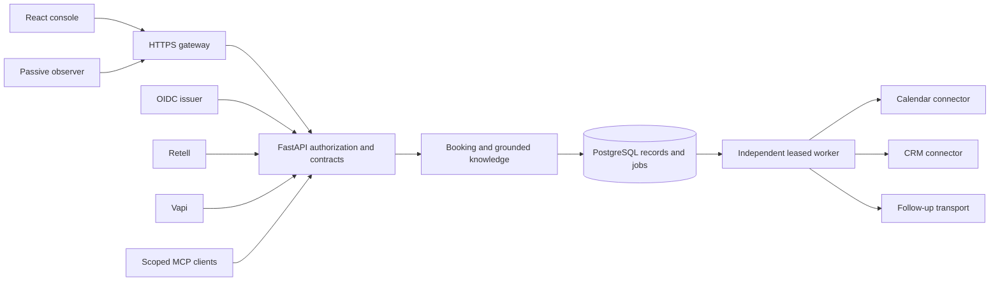

# Architecture and business boundaries

The current controlled deployment captures calendar/CRM/follow-up outcomes;
production external delivery has its own acceptance gate. Browser and native-call
tools use the same authorization and business rules.

## Decisions

| Decision                                       | Reason                                                        | Growth constraint                                              |
| ---------------------------------------------- | ------------------------------------------------------------- | -------------------------------------------------------------- |
| PostgreSQL owns bookings, idempotency and jobs | Transactions couple state and durable work                    | Connections, locks and hot records need measured limits        |
| Separate leased worker                         | Request timeouts do not determine delivery lifetime           | Backlog, provider quotas and unknown outcomes need supervision |
| Tenant locks and revisions                     | Concurrent intent cannot silently overwrite                   | Busy tenants can serialize; measure before narrowing locks     |
| Opaque server sessions                         | Browser receives no provider key or trusted tenant assignment | Session cleanup and regional routing need explicit design      |
| Shared Retell/Vapi services                    | Provider choice does not fork business policy                 | Native schemas/audio need provider-specific verification       |
| Typed settings and validated data              | One owner per changeable value                                | Version configuration/content with releases                    |
| Immutable releases and hash parity             | Auditable deployment/rollback                                 | Schema compatibility must permit rollback                      |

## Flows

Booking: authenticated identity -> tenant/role -> confirmation -> idempotency/revision
-> timezone/service/overlap validation -> durable reservation/calendar job -> verified
calendar receipt -> CRM/follow-up jobs. Pending acceptance is distinct from external
confirmation.

Knowledge: validated import -> revisioned storage -> tenant search -> source identities
-> answer or abstention. Retrieved instructions cannot authorize tools.

Native call: trusted owner prepares bounded intent/capability before native creation
-> returned ID bound to maintained provider/agent -> audio join -> platform-authenticated
tools/events -> terminal event retires scope. Native creation/binding/audio still needs
full live acceptance.

## Data and tenancy

Records include contacts, bookings, calls/transcripts, documents, agent revisions,
idempotency, jobs/receipts and authentication state. Services filter by tenant,
including read/management paths. Caller-provided identity cannot promote scope.
Database row policies, paged operator access, tenant placement and regional partitions
are future scale/security gates. See [API](api/README.md), [security](security-model.md)
and [scaling](capacity/scaling-roadmap.md).
