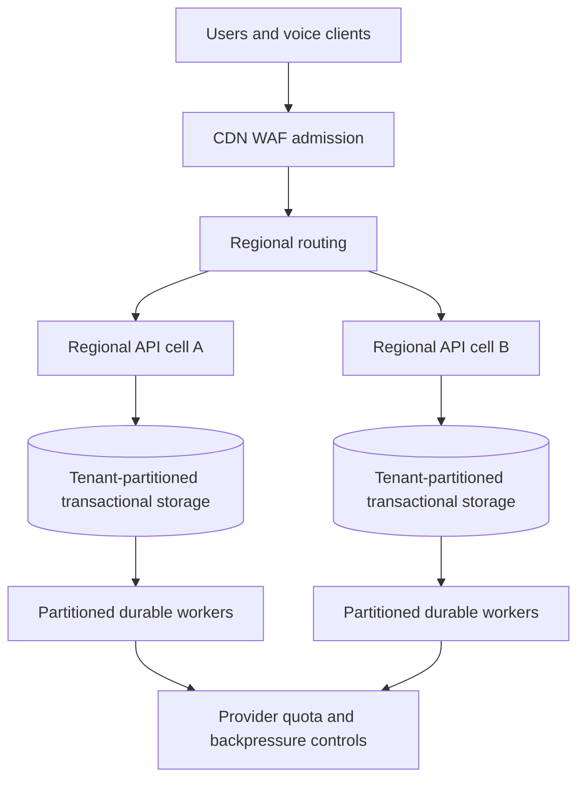

# Capacity roadmap: 1M+ concurrent users

This future target has staged capacity acceptance. The distributed architecture
must be implemented and measured before increasing admission beyond a validated stage.

| Workload                   | Definition                                          | Measurements                                           |
| -------------------------- | --------------------------------------------------- | ------------------------------------------------------ |
| Registered accounts        | Stored identities and records                       | Data/index volume and restore time                     |
| Concurrent dashboard users | Active sessions and their read/write cadence        | Requests/sec, connections, p95/p99 and saturation      |
| Concurrent voice calls     | Native audio sessions using business tools          | Concurrency/start/tool quotas and acoustic performance |
| Mixed workload             | Declared session/call split and tenant distribution | Shared bottlenecks, fairness and delivery lag          |

One million sessions refreshing every thirty seconds imply roughly 33,333 requests/
second before writes. One million five-minute calls imply roughly 3,333 admissions/
second in steady state. These are sizing assumptions, excluding bursts/reconnects/
retries. Use `concurrency = arrival rate × average lifetime` with measured inputs.

## Target topology

Separate failure domains and regional cells with explicit tenant placement. Keep
one consistency authority/writer per booking resource. Session routing, regional
failover and residency must agree. Add connection pooling, indexes, pagination,
bounded caches and read replicas only with defined consistency. Narrow tenant
locks only after concurrency regressions. A cache cannot confirm an uncommitted
booking or invent availability.

Workers need partitioning, fairness, backpressure, receipt reconciliation and
dead-letter handling. An external queue requires a transactional outbox and
idempotent consumption. Admission controls provider concurrency/start/tool quotas,
circuit breakers and bounded retry. Business HTTP capacity does not establish audio
or telephony capacity.

Kubernetes is optional orchestration, requiring resource requests, readiness,
disruption policies and measured scaling signals. Database/provider bottlenecks
remain outside pod autoscaling. See the official
[autoscaling guide](https://kubernetes.io/docs/concepts/workloads/autoscaling/).

## Stages

| Stage | Intended scope                        | Exit evidence                                                                        |
| ----- | ------------------------------------- | ------------------------------------------------------------------------------------ |
| C0    | Guarded local baseline                | Environment/data, latency/errors, recovery and stop limits                           |
| C1    | 100–1,000 concurrent sessions         | Pagination, realistic cadence, pool/worker saturation                                |
| C2    | 10,000 concurrent sessions            | Multiple replicas, fairness, spike/soak and one-node loss                            |
| C3    | 100,000 concurrent sessions           | Partitions, database failover, quotas and headroom                                   |
| C4    | 1M+ concurrent users                  | Distributed generators, declared mixed workload, regional failure and sustained SLOs |
| V1–V4 | Separate increasing voice concurrency | Written provider quotas, small real audio acceptance, staged call tests              |

These are planned gates, not hardware promises. Determine throughput/data size
before instance counts. Reserve measured headroom for a failed replica/cell and
account for tenant skew and retry amplification.

## Safe tests and deliverables

Most tests use local controlled transports/isolated databases. Ramp gradually;
cap duration, concurrency and data growth; stop at configured CPU/memory/pool/error/
latency limits. Measure generator saturation separately. Heavy tests must not slow
shared live services or affect other projects.

Run baseline/ramp/spike/soak/recovery/failover against exact releases/configuration.
Check duplicates and normal-user latency during load. Live voice requires approved
costs/quotas and the smallest useful sample. High native traffic cannot be assumed
free or inferred from HTTP tests.

Each stage delivers workload/data profiles, latency/resource charts, provider
quota evidence, cost envelope, saturation diagnosis, failure drills and an admission
ceiling. See [load criteria](core-load-spec.md), [reliability](../reliability.md)
and [build-plan gates](../../BUILD-PLAN.md).
